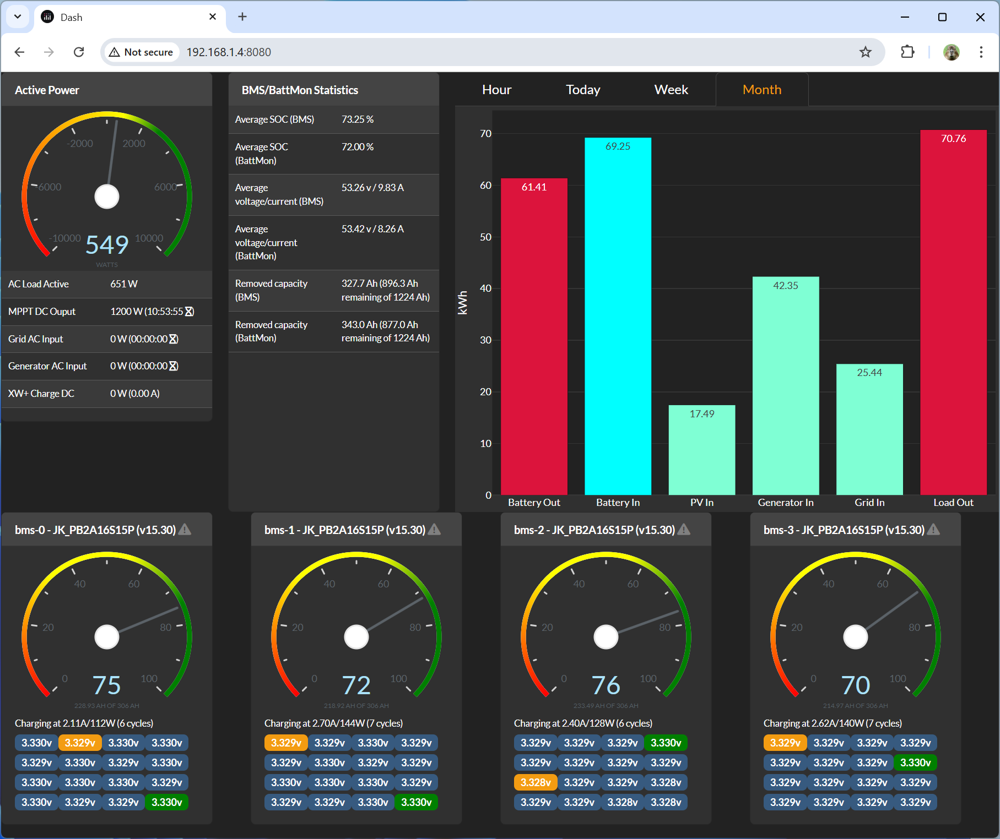

## Introduction

BerryBMS is a small project to gather and show Schneider Conext and JK BMS data. It is meant to show what's relevant in a single page. Here's how the dashboard looks like with four JK BMS:



## Installation

Installation instructions are tailored towards Debian 12 running on a Raspberry Pi. First you should create a normal user under which everything will be run. 

First, install Debian-included packages:

```
apt-get install mosquitto python3
```

Then, proceed with the following instructions to setup the local Python environment as it requires dependancies not found in Debian 12 or that are way too outdated:

```
cd ~/berrybms
mkdir venv
python3 -m venv venv
source venv/bin/activate
pip3 install pymodbus==3.8.2
pip3 install pyyaml
pip3 install paho-mqtt
pip3 install pyserial
pip3 install python-can
```

If you want to have the Web GUI that uses Dash/Plotly:

```
pip3 install dash
pip3 install dash-bootstrap-components
pip3 install dash-bootstrap-templates
pip3 install https://github.com/plotly/dash-daq/archive/refs/heads/master.zip
pip3 install flask-mqtt
```

## Connection to JK BMS

First, you need at least one USB-to-RS485 adapter. On the adapter, connect RJ-45 pin 6 (orange) to A+ and pin 3 (white orange) to B-.

If you want to use BerryBMS in `sniffer mode`, you can simply connect your USB-to-RS485 adapter directly in one of the available RS485-2 port of either BMS (master or slave). For these ports, the `015 - UART Protocol 015` protocol will be used on the master (DIP switch set to 0) and the `001 - JK BMS RS485 Modbus 1.0` protocol will be used on all slaves.

If you want to use BerryBMS in `polling mode`, you will have to connect your USB-to-RS485 adapter (with as many channels as BMS you have) to each BMS's RS485-1 port. The `001 - JK BMS RS485 Modbus 1.0` will be used all RS485-1 ports.

You can use `sniffer mode` and `polling mode` simultaneously.

## Connection to Conext

If you have a Conext InsightHome, you can configure BerryBMS in `polling mode` and it will use Modbus over TCP to pull information from the Conext InsightHome.

If you want to use BerryBMS in `sniffer mode`, you must connect your USB-to-CAN adapter in the Xanbus network, just like any other Xanbus-enabled Conext devices. On the USD-to-CAN adapter, connect RJ-45 pin 4 to CAN_L and pin 5 to CAN_H. After connecting your CAN adapter, make you enable the `can0` interface using:

```
/sbin/ip link set can0 up type can bitrate 250000
```

Optionally, you can also use `socketcand` (https://github.com/linux-can/socketcand) to guarentee delivery and ordering of CAN messages to BerryBMS.

You can use `sniffer mode` and `polling mode` simultaneously.

## Using

First, modify `config.yaml` to your needs.

Once the configuration file has been adjusted to your needs, you can use this application directly from the command-line, simply do:

```
cd ~/berrybms
python3 -m venv
python3 berrybms/berrybms.py
```

This will output tons of information and push things in MQTT. What's pushed in MQTT can be used by the Dash/Plotly frontend of this application. Alternatively, you can use the date with any other solution, like Node-RED. You can also add the `-d` parameter to make it run continuously, it will pause at the configured interval between each data fetch.

If you want to try the Web GUI, simply do:

```
python3 berrybms/berrydash.py
```

and open using your favorite web browser `http://<IP of your Raspberry PI device>:8080/`.

## Running As Service

If you want to run this program through systemd, first edit `berrybms.service` and adjust the path relative to the user the program will be running as. Then, do:

```
sudo cp berrybms.service /lib/systemd/system/
sudo chmod 644 /lib/systemd/system/berrybms.service
sudo systemctl daemon-reload
sudo systemctl enable berrybms.service
sudo systemctl start berrybms.service
```

If you want the Dash interface as a service, first edit `berrydash.service` and adjust the path relative to the user the program will be running as. Then, do:

```
sudo cp berrydash.service /lib/systemd/system/
sudo chmod 644 /lib/systemd/system/berrydash.service
sudo systemctl daemon-reload
sudo systemctl enable berrydash.service
sudo systemctl start berrydash.service
```

## What's Next?

I have some ideas floating around for future improvements. Among them, there are:

1. Better error-handling everywhere
2. Adjust labelling based on XW grid input associations
3. Offer some actions through the Web GUI (start/stop the generator, enable/disable BMS charge/discharge, etc.)
4. Offer pack balancing capabilities by enabling/disabling charge/discharge on each BMS to maintain close SOC between BMS
5. Add support for a single-channel relay to start/stop the generator based on SOC