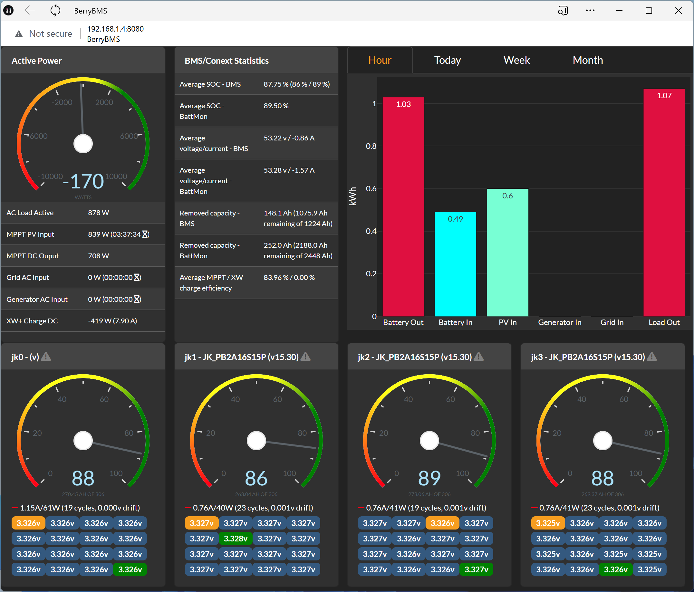

## Introduction

BerryBMS is a small project to gather and show Schneider Conext and JK BMS data. It is meant to show what's relevant in a single page. Here's how the dashboard looks like with four JK BMS:



## Installation

Installation instructions are tailored towards Debian 12 running on a Raspberry Pi. First you should create a normal user under which everything will be run. 

First, install Debian-included packages:

```
apt-get install mosquitto python3
```

Then, proceed with the following instructions to setup the local Python environment as it requires dependancies not found in Debian 12 or that are way too outdated:

```
cd ~/berrybms
mkdir venv
python3 -m venv venv
source venv/bin/activate
pip3 install pymodbus==3.8.2
pip3 install pyyaml
pip3 install paho-mqtt
pip3 install pyserial
```

If you want to have the Web GUI that uses Dash/Plotly:

```
pip3 install dash
pip3 install dash-bootstrap-components
pip3 install dash-bootstrap-templates
pip3 install https://github.com/plotly/dash-daq/archive/refs/heads/master.zip
pip3 install flask-mqtt
```

## Using

First, modify `config.yaml` to your needs.

Once the configuration file has been adjusted to your needs, you can use this application directly from the command-line, simply do:

```
cd ~/berrybms
python3 -m venv
python3 berrybms/berrybms.py
```

This will output tons of information and push things in MQTT. What's pushed in MQTT can be used by the Dash/Plotly frontend of this application. Alternatively, you can use the date with any other solution, like Node-RED.

If you want to try the Web GUI, simply do:

```
python3 berrybms/berrydash.py
```

and open using your favorite web browser `http://<IP of your Raspberry PI device>:8080/`.

## Running As Service

If you want to run this program through systemd, first edit `berrybms.service` and adjust the path relative to the user the program will be running as. Then, do:

```
sudo cp berrybms.service /lib/systemd/system/
sudo chmod 644 /lib/systemd/system/berrybms.service
sudo systemctl daemon-reload
sudo systemctl enable berrybms.service
sudo systemctl start berrybms.service
```

If you want the Dash interface as a service, first edit `berrydash.service` and adjust the path relative to the user the program will be running as. Then, do:

```
sudo cp berrydash.service /lib/systemd/system/
sudo chmod 644 /lib/systemd/system/berrydash.service
sudo systemctl daemon-reload
sudo systemctl enable berrydash.service
sudo systemctl start berrydash.service
```

## What's Next?

I have some ideas floating around for future improvements. Among them, there are:

1. Better error-handling everywhere
2. Adjust labelling based on XW grid input associations
3. Offer some actions through the Web GUI (start/stop the generator, enable/disable BMS charge/discharge, etc.)
4. Offer pack balancing capabilities by enabling/disabling charge/discharge on each BMS to maintain close SOC between BMS